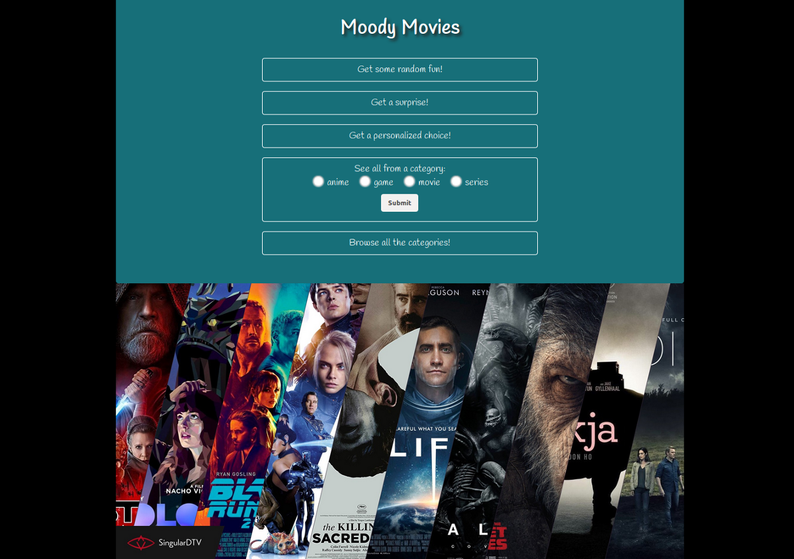
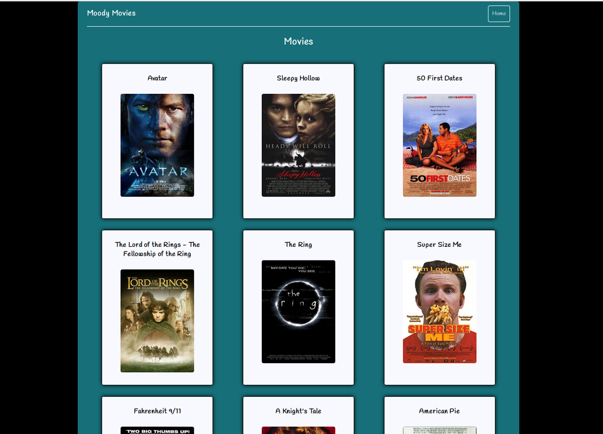
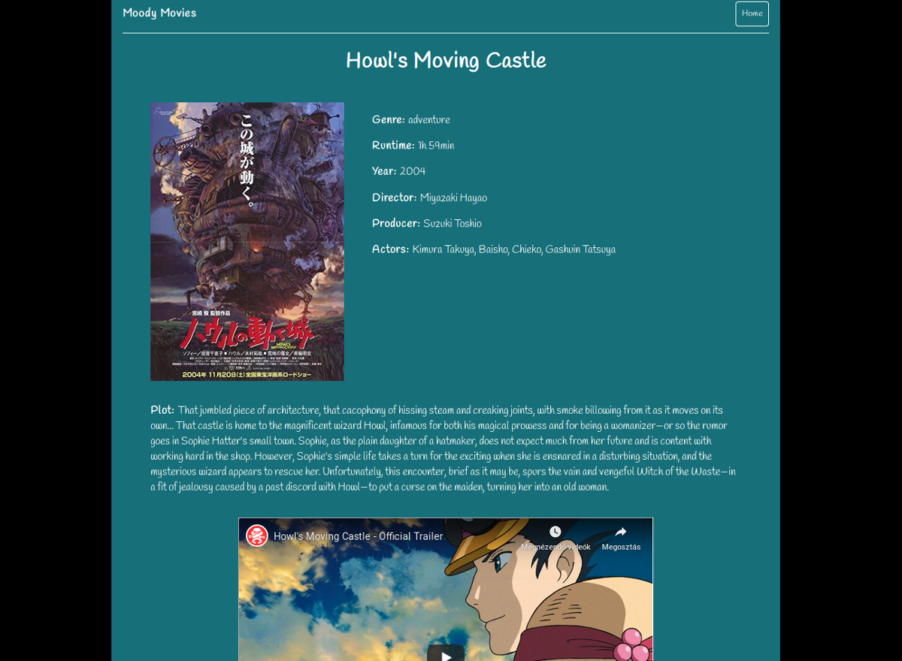

# Moody Movies
## Codecool Java Enterprise Module, 4th TW week's project

Our task was to create a Java web application consisting of several microservices that communicate with each other via REST APIs. We decided on a film/game-related topic: the application recommends an anime/movie/series/game to the user either randomly chosing from the microservices' databases or finding the most appropriate one based on the user's answers to a short, funny questionnaire. Users can also browse each category and see the details of the chosen film/game.

Technologies: Java / Spring Boot, H2 databases / Hibernate, Spring Cloud (Eureka, Zuul), Swagger, Lombok, Angular 8.

Home page:

Movies page:

Details page:

